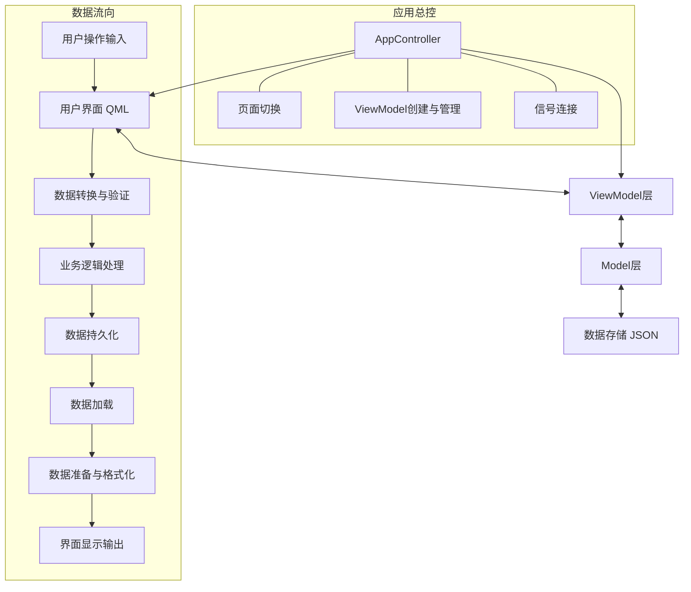
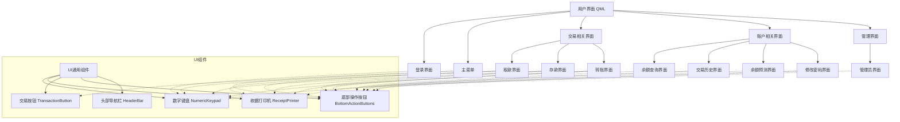
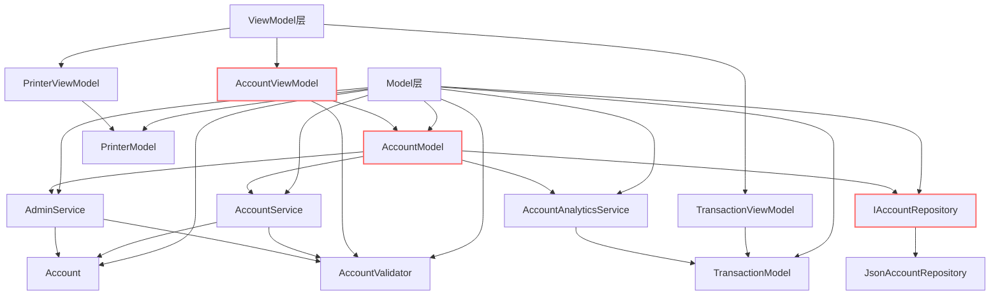
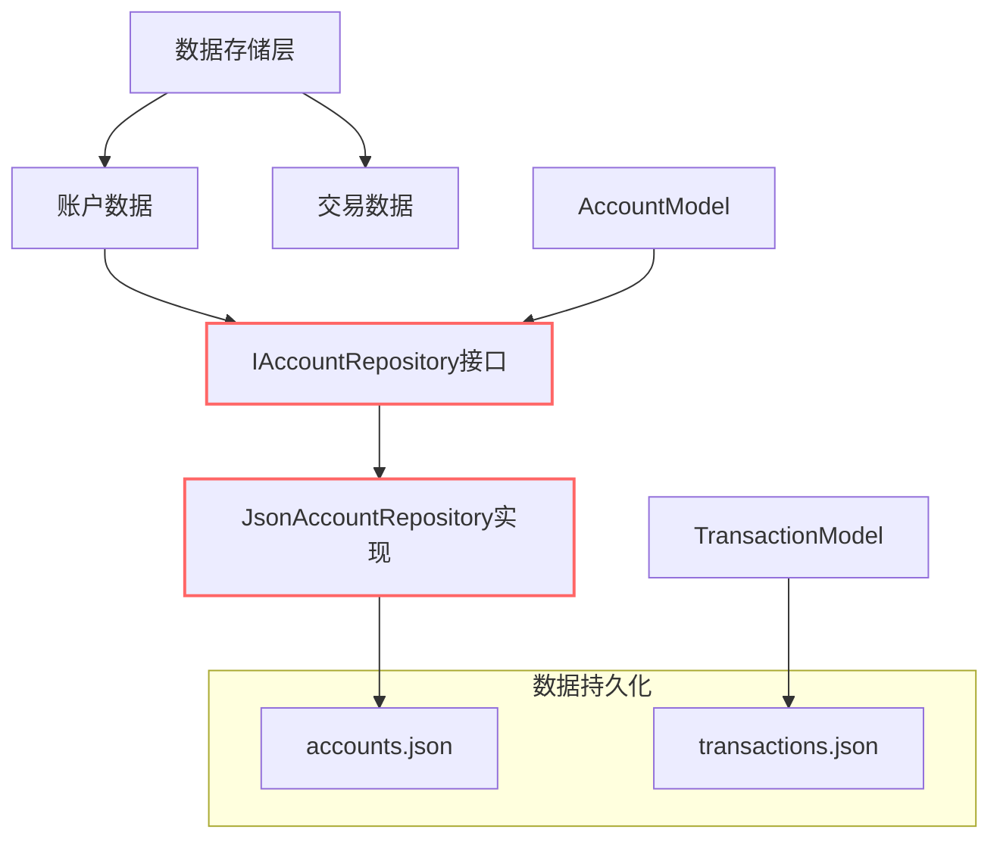
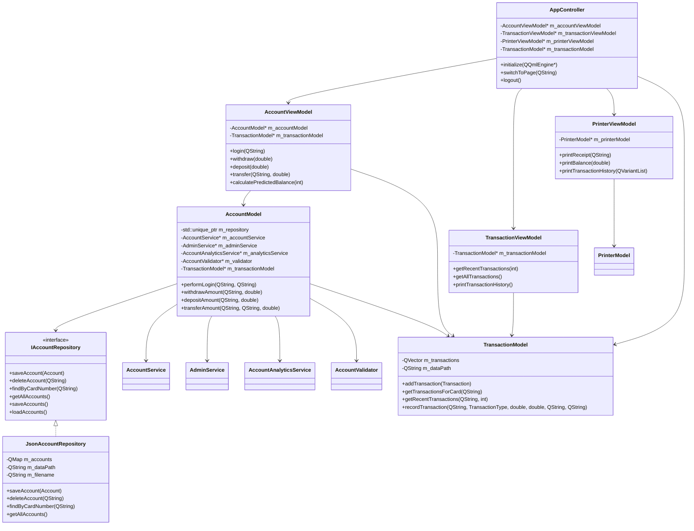
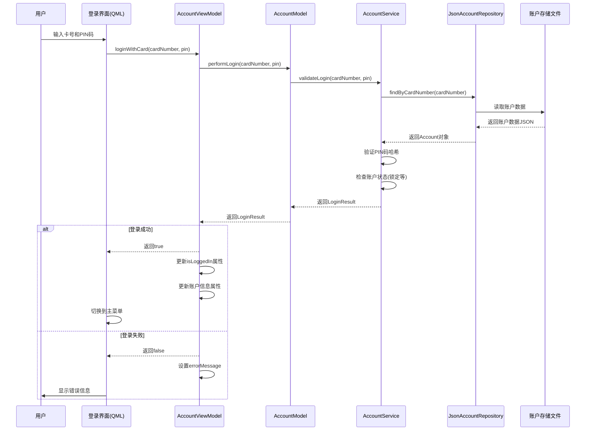
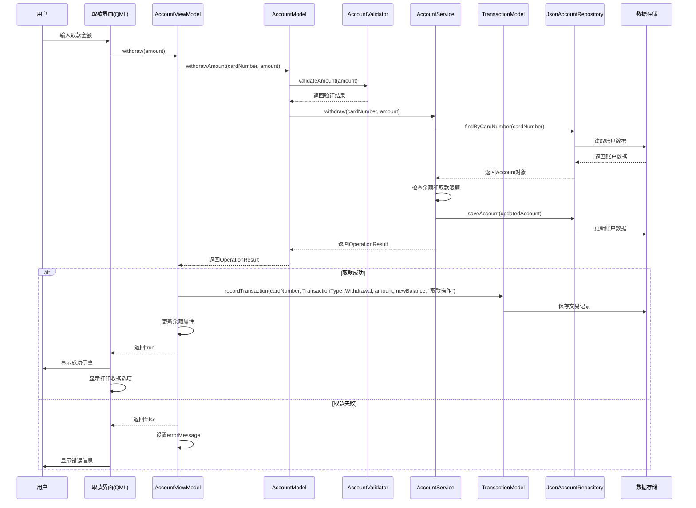
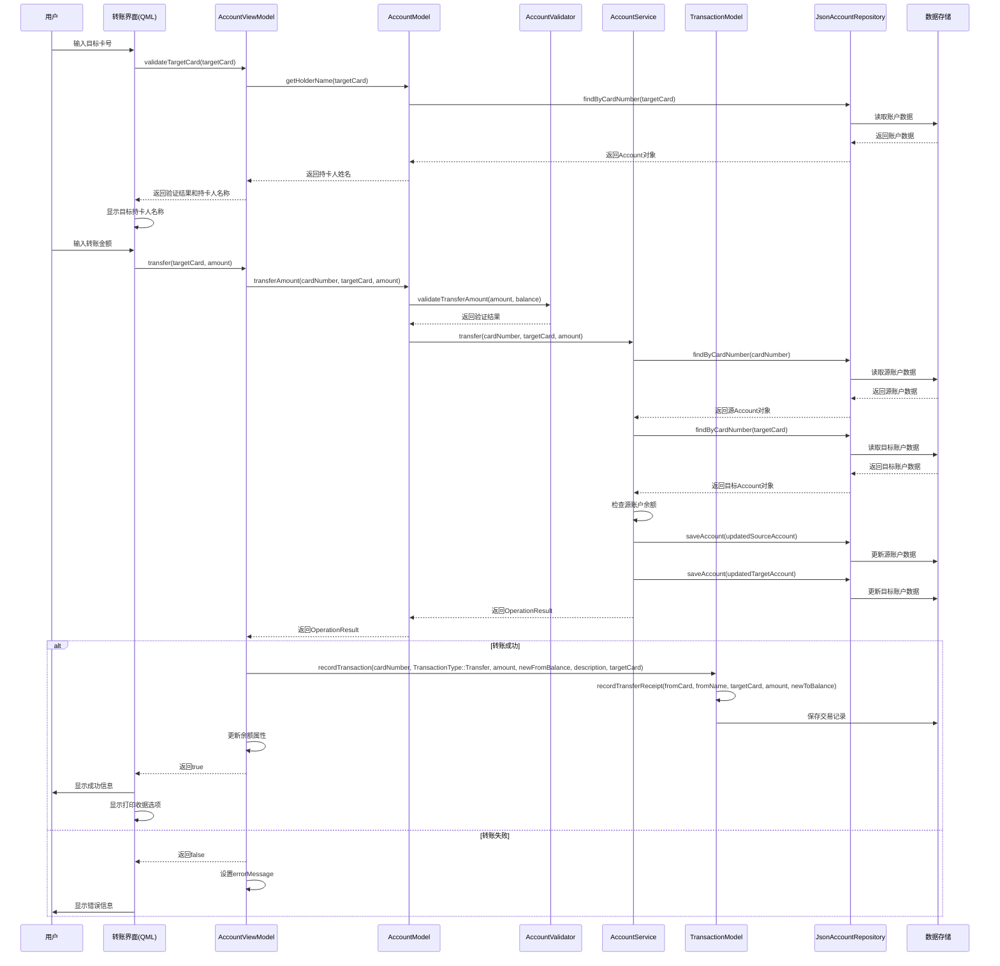
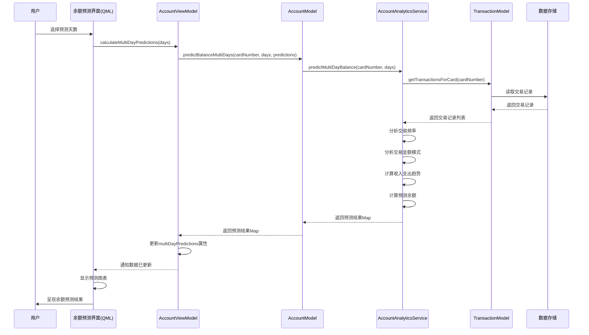
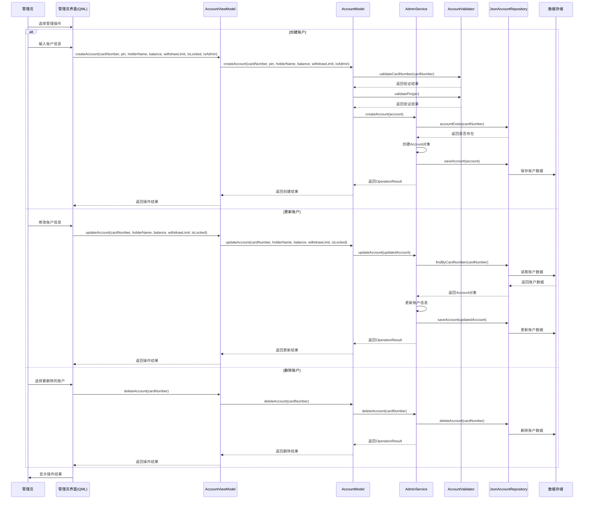

# ATM 模拟器应用程序文档

## 一、功能框架

ATM 模拟器应用程序采用 MVVM (Model-View-ViewModel) 架构模式，使用 C++ 实现核心业务逻辑，使用 QML 实现用户界面。系统分为四个主要部分：视图层、视图模型层、模型层和数据存储层。

### 1. 系统整体架构图



### 2. 视图层结构



### 3. 模型和视图模型层结构



### 4. 数据存储结构



### 5. 详细类关系图



## 二、概要设计

### 1. 主要存储结构

#### Account 账户类
```cpp
class Account {
public:
    QString cardNumber;      // 卡号
    QString pinHash;         // PIN码哈希
    QString salt;            // 盐值
    QString holderName;      // 持卡人姓名
    double balance;          // 账户余额
    double withdrawLimit;    // 单次取款限额
    bool isLocked;           // 是否锁定
    bool isAdmin;            // 是否管理员
    int failedLoginAttempts; // 登录失败次数
    QDateTime lastFailedLogin; // 最后失败时间
    QDateTime temporaryLockTime; // 临时锁定时间
    
    // 方法
    bool isValid() const;
    bool isValidPin(const QString& pin) const;
    bool verifyPin(const QString& pin) const;
    void setPin(const QString& pin);
    static QString hashPin(const QString& pin, const QString& salt);
    static QString generateSalt();
    bool recordFailedLogin();
    void resetFailedLoginAttempts();
    bool isTemporarilyLocked() const;
    QJsonObject toJson() const;
    static Account fromJson(const QJsonObject &json);
};
```

#### Transaction 交易结构体
```cpp
struct Transaction {
    QString cardNumber;        // 交易卡号
    QDateTime timestamp;       // 交易时间
    TransactionType type;      // 交易类型
    double amount;             // 交易金额
    double balanceAfter;       // 交易后余额
    QString description;       // 交易描述
    QString targetCardNumber;  // 目标卡号（转账时）
    
    // 方法
    QJsonObject toJson() const;
    static Transaction fromJson(const QJsonObject &json);
};
```

#### TransactionType 交易类型枚举
```cpp
enum class TransactionType {
    Deposit,        // 存款
    Withdrawal,     // 取款
    BalanceInquiry, // 余额查询
    Transfer,       // 转账
    Other           // 其他
};
```

#### LoginResult 登录结果类
```cpp
class LoginResult {
public:
    bool success;         // 是否成功
    QString errorMessage; // 错误消息
    bool isAdmin;         // 是否管理员
    
    // 方法
    LoginResult();
    LoginResult(bool success, const QString& message = QString(), bool isAdmin = false);
};
```

#### OperationResult 操作结果类
```cpp
class OperationResult {
public:
    bool success;         // 是否成功
    QString errorMessage; // 错误消息
    
    // 方法
    OperationResult();
    OperationResult(bool success, const QString& message = QString());
};
```

### 2. 程序函数概要

#### 模型层(Model)函数
- **AccountModel**: 管理账户数据的增删改查
  - `Account getAccount(const QString &cardNumber)` - 获取指定卡号的账户
  - `LoginResult validateLogin(const QString &cardNumber, const QString &pin)` - 验证登录
  - `OperationResult createAccount(const Account &account)` - 创建新账户
  - `OperationResult updateAccount(const Account &account)` - 更新账户信息
  - `OperationResult deleteAccount(const QString &cardNumber)` - 删除账户
  - `OperationResult withdraw(const QString &cardNumber, double amount)` - 处理取款操作
  - `OperationResult deposit(const QString &cardNumber, double amount)` - 处理存款操作
  - `OperationResult transfer(const QString &fromCard, const QString &toCard, double amount)` - 处理转账操作
  - `OperationResult changePassword(const QString &cardNumber, const QString &currentPin, const QString &newPin)` - 修改密码

- **TransactionModel**: 管理交易记录
  - `void addTransaction(const Transaction &transaction)` - 添加交易记录
  - `QVector<Transaction> getTransactionsForCard(const QString &cardNumber)` - 获取指定卡号的全部交易
  - `QVector<Transaction> getRecentTransactions(const QString &cardNumber, int count)` - 获取最近交易
  - `void recordTransaction(const QString &cardNumber, TransactionType type, double amount, double balanceAfter, const QString &description, const QString &targetCard = QString())` - 记录新交易

- **AccountAnalyticsService**: 提供账户分析功能
  - `double predictFutureBalance(const QString &cardNumber, int daysInFuture)` - 预测未来余额
  - `QMap<int, double> predictMultiDayBalance(const QString &cardNumber, const QVector<int> &days)` - 多日期余额预测
  - `QVector<Transaction> getTransactionHistory(const QString &cardNumber, int count = 10)` - 获取交易历史

- **AccountValidator**: 验证账户相关数据
  - `bool validateCardNumber(const QString &cardNumber)` - 验证卡号格式
  - `bool validatePin(const QString &pin)` - 验证PIN码格式
  - `bool validateAmount(double amount)` - 验证金额有效性
  - `bool validateTransferAmount(double amount, double balance)` - 验证转账金额

#### 视图模型层(ViewModel)函数
- **AccountViewModel**: 连接账户模型与UI
  - `bool login(const QString &pin)` - 登录处理
  - `bool loginWithCard(const QString &cardNumber, const QString &pin)` - 使用卡号和PIN登录
  - `bool adminLogin(const QString &cardNumber, const QString &pin)` - 管理员登录
  - `bool withdraw(double amount)` - 取款操作
  - `bool deposit(double amount)` - 存款操作
  - `bool transfer(const QString &targetCard, double amount)` - 转账操作
  - `bool changePassword(const QString &currentPin, const QString &newPin, const QString &confirmPin)` - 修改密码
  - `void calculatePredictedBalance(int daysInFuture = 7)` - 计算预测余额
  - `void calculateMultiDayPredictions(const QString &days)` - 计算多日期预测

- **TransactionViewModel**: 连接交易模型与UI
  - `QVariantList getRecentTransactions(int count = 10)` - 获取最近交易列表
  - `QVariantList getAllTransactions()` - 获取所有交易列表
  - `QString formatTransaction(const Transaction &transaction)` - 格式化交易显示
  - `void printTransactionHistory()` - 打印交易历史

- **PrinterViewModel**: 连接打印机模型与UI
  - `void printReceipt(const QString &content)` - 打印收据
  - `void printBalance(double balance)` - 打印余额信息
  - `void printTransactionHistory(const QVariantList &transactions)` - 打印交易历史

#### 控制层函数
- **AppController**: 应用程序控制器
  - `void initialize(QQmlEngine* engine)` - 初始化应用
  - `void switchToPage(const QString &pageName)` - 切换页面
  - `void logout()` - 处理登出操作

### 3. 主要函数流程

#### 登录流程


#### 取款流程


#### 转账流程


#### 余额预测流程


#### 管理员操作流程


## 三、功能测试情况

ATM模拟器进行了全面的人工测试，测试了所有核心功能和边界情况。以下是测试的主要场景和结果：

### 1. 登录功能测试

- **测试场景**：正确/错误的卡号和PIN码组合
- **测试结果**：系统能正确验证用户身份，锁定机制在多次错误尝试后生效
- **测试截图位置**：
  - *[登录界面截图 - 插入 login_screen.png]*
  - *[错误登录提示截图 - 插入 login_error.png]*
  - *[账户锁定提示截图 - 插入 account_locked.png]*

### 2. 取款功能测试

- **测试场景**：正常取款、超过余额取款、超过限额取款
- **测试结果**：系统能正确处理取款请求，并在异常情况下给出适当提示
- **测试截图位置**：
  - *[取款界面截图 - 插入 withdraw_screen.png]*
  - *[取款成功截图 - 插入 withdraw_success.png]*
  - *[余额不足提示截图 - 插入 insufficient_balance.png]*
  - *[超过限额提示截图 - 插入 exceed_limit.png]*

### 3. 存款功能测试

- **测试场景**：正常存款、存款金额验证
- **测试结果**：系统能正确处理存款请求，验证金额合法性
- **测试截图位置**：
  - *[存款界面截图 - 插入 deposit_screen.png]*
  - *[存款成功截图 - 插入 deposit_success.png]*
  - *[金额无效提示截图 - 插入 invalid_amount.png]*

### 4. 转账功能测试

- **测试场景**：正常转账、无效目标账户、余额不足转账
- **测试结果**：系统能正确验证目标账户，处理转账请求，并在异常情况下给出适当提示
- **测试截图位置**：
  - *[转账界面截图 - 插入 transfer_screen.png]*
  - *[目标账户验证截图 - 插入 target_validation.png]*
  - *[转账成功截图 - 插入 transfer_success.png]*
  - *[无效账户提示截图 - 插入 invalid_account.png]*

### 5. 余额查询功能测试

- **测试场景**：查询当前余额
- **测试结果**：系统能正确显示当前余额
- **测试截图位置**：
  - *[余额查询界面截图 - 插入 balance_screen.png]*

### 6. 交易历史功能测试

- **测试场景**：查看交易历史
- **测试结果**：系统能正确显示交易历史记录
- **测试截图位置**：
  - *[交易历史界面截图 - 插入 transaction_history.png]*
  - *[打印交易记录截图 - 插入 print_history.png]*

### 7. 余额预测功能测试

- **测试场景**：预测未来各个时间点的余额
- **测试结果**：系统根据历史交易模式预测未来余额变化
- **测试截图位置**：
  - *[余额预测界面截图 - 插入 balance_prediction.png]*
  - *[多日期预测图表截图 - 插入 prediction_chart.png]*

### 8. 修改密码功能测试

- **测试场景**：使用正确/错误的当前密码修改密码
- **测试结果**：系统能正确验证当前密码，并在条件满足时更新密码
- **测试截图位置**：
  - *[密码修改界面截图 - 插入 change_password.png]*
  - *[密码修改成功截图 - 插入 password_changed.png]*
  - *[当前密码错误提示截图 - 插入 wrong_current_password.png]*

### 9. 管理员功能测试

- **测试场景**：管理员登录、创建账户、修改账户、删除账户
- **测试结果**：系统能正确识别管理员权限，执行管理操作
- **测试截图位置**：
  - *[管理员界面截图 - 插入 admin_panel.png]*
  - *[创建账户界面截图 - 插入 create_account.png]*
  - *[账户列表截图 - 插入 account_list.png]*
  - *[账户操作成功截图 - 插入 account_operation_success.png]*

### 10. 安全功能测试

- **测试场景**：连续登录失败锁定、系统超时退出
- **测试结果**：安全机制能正常工作，保护账户安全
- **测试截图位置**：
  - *[连续登录失败截图 - 插入 multiple_failed_login.png]*
  - *[临时锁定提示截图 - 插入 temporary_lock.png]*
  - *[超时退出提示截图 - 插入 timeout_logout.png]*

## 四、项目文件结构

项目采用CMake构建系统，主要分为以下几个目录：

```
ATM-simulator/
├── CMakeLists.txt              # 主CMake配置文件，定义项目和编译选项
├── CMakeLists.txt.user         # Qt Creator用户配置文件
├── CMakePresets.json           # CMake预设配置
├── src/                        # 源代码目录
│   ├── main.cpp                # 应用程序入口点
│   ├── AppController.h         # 应用程序控制器头文件
│   ├── AppController.cpp       # 应用程序控制器实现
│   ├── models/                 # 模型层目录
│   │   ├── Account.h           # 账户实体类头文件
│   │   ├── Account.cpp         # 账户实体类实现
│   │   ├── AccountModel.h      # 账户模型门面类头文件
│   │   ├── AccountModel.cpp    # 账户模型门面类实现
│   │   ├── AccountService.h    # 账户服务类头文件
│   │   ├── AccountService.cpp  # 账户服务类实现
│   │   ├── AccountValidator.h  # 账户验证器头文件
│   │   ├── AccountValidator.cpp # 账户验证器实现
│   │   ├── AdminService.h      # 管理员服务头文件
│   │   ├── AdminService.cpp    # 管理员服务实现
│   │   ├── AccountAnalyticsService.h  # 账户分析服务头文件
│   │   ├── AccountAnalyticsService.cpp # 账户分析服务实现
│   │   ├── IAccountRepository.h # 账户存储库接口
│   │   ├── JsonAccountRepository.h # JSON账户存储库头文件
│   │   ├── JsonAccountRepository.cpp # JSON账户存储库实现
│   │   ├── LoginResult.h       # 登录结果类头文件
│   │   ├── LoginResult.cpp     # 登录结果类实现
│   │   ├── OperationResult.h   # 操作结果类头文件
│   │   ├── OperationResult.cpp # 操作结果类实现
│   │   ├── TransactionModel.h  # 交易模型头文件
│   │   ├── TransactionModel.cpp # 交易模型实现
│   │   ├── PrinterModel.h      # 打印机模型头文件
│   │   └── PrinterModel.cpp    # 打印机模型实现
│   │
│   └── viewmodels/             # 视图模型层目录
│       ├── AccountViewModel.h  # 账户视图模型头文件
│       ├── AccountViewModel.cpp # 账户视图模型实现
│       ├── TransactionViewModel.h # 交易视图模型头文件
│       ├── TransactionViewModel.cpp # 交易视图模型实现
│       ├── PrinterViewModel.h  # 打印机视图模型头文件
│       └── PrinterViewModel.cpp # 打印机视图模型实现
│
├── qml/                        # QML视图层目录
│   ├── main.qml               # 主窗口界面
│   ├── LoginPage.qml          # 登录界面
│   ├── MainMenu.qml           # 主菜单界面
│   ├── WithdrawPage.qml       # 取款界面
│   ├── DepositPage.qml        # 存款界面
│   ├── TransferPage.qml       # 转账界面
│   ├── BalancePage.qml        # 余额查询界面
│   ├── TransactionHistoryPage.qml # 交易历史界面
│   ├── BalancePredictionPage.qml # 余额预测界面
│   ├── ChangePasswordPage.qml # 修改密码界面
│   ├── AdminPage.qml          # 管理员界面
│   └── components/            # UI组件目录
│       ├── NumericKeypad.qml  # 数字键盘组件
│       ├── ReceiptPrinter.qml # 收据打印机组件
│       ├── TransactionButton.qml # 交易按钮组件
│       ├── BottomActionButtons.qml # 底部操作按钮组件
│       ├── HeaderBar.qml      # 头部导航栏组件
│       └── qmldir             # QML模块定义文件
│
└── resources/                  # 资源文件目录
    └── images/                 # 图片资源
```

## 五、GitHub 项目地址

项目托管在 GitHub 上，可通过以下链接访问：

[https://github.com/hicancan/ATM-simulator](https://github.com/hicancan/ATM-simulator)

### 克隆项目

```bash
git clone https://github.com/hicancan/ATM-simulator.git
cd ATM-simulator
```

### 构建项目

```bash
mkdir build
cd build
cmake ..
make
```

### 运行项目

```bash
./ATM-simulator
``` 