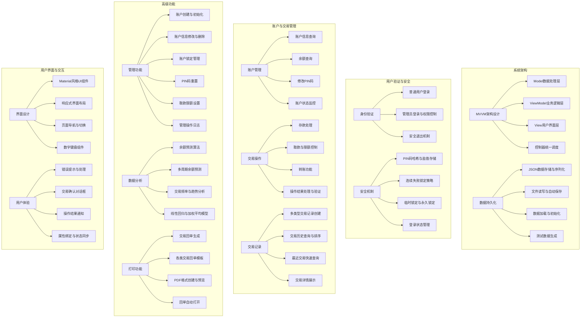
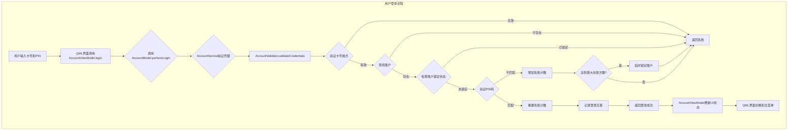
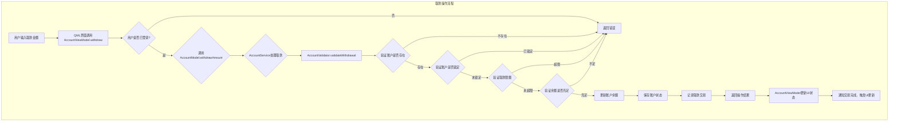
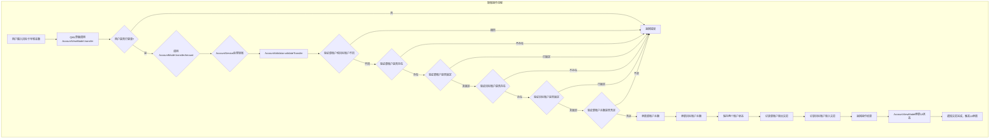
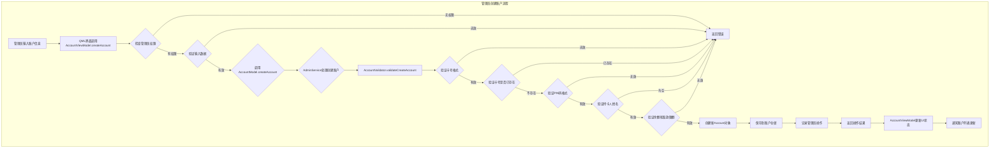
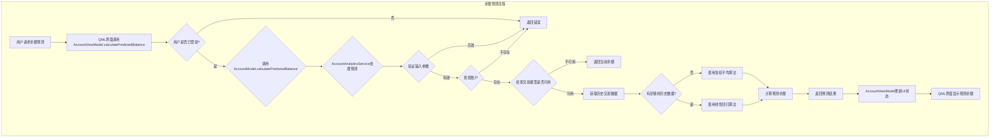

# ATM 模拟器 (ATM Simulator)

基于MVVM架构的ATM自助银行系统模拟器，采用Qt/QML实现的跨平台应用。

## 功能框架图



## 功能详细描述

### 系统架构

**MVVM架构设计**
- **Model数据处理层**：负责数据实体定义、数据操作和业务逻辑实现，如Account、TransactionModel等类。
- **ViewModel业务逻辑层**：连接Model和View，处理UI事件并操作Model层数据，如AccountViewModel、TransactionViewModel。
- **View用户界面层**：由QML实现的用户界面，通过属性绑定自动同步ViewModel中的数据变化。
- **控制器统一调度**：AppController作为中央协调器，管理对象创建和生命周期，连接组件间的信号和槽。

**数据持久化**
- **JSON数据存储与序列化**：使用JSON格式存储账户信息和交易记录，便于读写和跨平台。
- **文件读写与自动保存**：JsonPersistenceManager实现文件读写，变更数据时自动保存。
- **数据加载与初始化**：应用启动时自动加载已有数据，首次运行时生成初始测试数据。
- **测试数据生成**：提供默认测试账户和交易记录，便于功能验证和演示。

### 用户验证与安全

**身份验证**
- **普通用户登录**：验证卡号与PIN码匹配，限制访问个人账户功能。
- **管理员登录与权限控制**：特殊账户权限，可执行账户管理等高级操作。
- **安全退出机制**：自动清除登录状态，保护用户安全。

**安全机制**
- **PIN码哈希与盐值存储**：使用SHA-256算法和随机盐值哈希存储PIN码，提高安全性。
- **连续失败锁定策略**：账户在连续多次登录失败后自动锁定。
- **临时锁定与永久锁定**：区分临时锁定（时间限制）和永久锁定（需管理员解锁）。
- **登录状态管理**：维护当前登录状态，控制功能访问权限。

### 账户与交易管理

**账户管理**
- **账户信息查询**：查看持卡人信息、账号及余额等基本信息。
- **余额查询**：实时显示当前账户余额，支持详细信息查看。
- **修改PIN码**：允许用户修改个人PIN码，包含多重验证。
- **账户状态监控**：监控账户锁定状态、登录失败次数等。

**交易操作**
- **存款处理**：支持现金存款功能，即时更新账户余额。
- **取款与限额控制**：支持现金取款，并根据账户设置限制单次取款金额。
- **转账功能**：支持向其他账户转账，包含账户验证和余额检查。
- **操作结果处理与验证**：所有操作均返回详细结果，包含成功/失败信息。

**交易记录**
- **多类型交易记录创建**：自动记录各类交易，包括存款、取款、转账等。
- **交易历史查询与排序**：查看历史交易记录，支持时间排序。
- **最近交易快速查询**：快速查看最近的N条交易记录。
- **交易详情展示**：展示交易的完整信息，包括时间、金额、余额等。

### 高级功能

**管理功能**
- **账户创建与初始化**：管理员可创建新账户，设置初始余额和权限。
- **账户信息修改与删除**：管理员可修改账户信息或删除账户。
- **账户锁定管理**：管理员可锁定/解锁账户，处理异常情况。
- **PIN码重置**：管理员可为用户重置PIN码。
- **取款限额设置**：管理员可调整账户的取款限额。
- **管理操作日志**：记录所有管理操作，便于审计和追踪。

**数据分析**
- **余额预测算法**：基于历史交易数据预测未来账户余额。
- **多周期余额预测**：支持多个时间周期的余额预测（7天、14天、30天等）。
- **交易频率与趋势分析**：分析用户交易频率和金额变化趋势。
- **线性回归与加权平均模型**：使用数学模型提高预测准确性，近期数据权重更高。

**打印功能**
- **交易回单生成**：生成详细的交易凭证，包含所有交易信息。
- **各类交易回单模板**：不同交易类型使用专门的回单模板。
- **PDF格式创建与预览**：生成标准PDF格式回单文件。
- **回单自动打开**：打印完成后自动打开查看。

### 用户界面与交互

**界面设计**
- **Material风格UI组件**：采用现代Material设计风格，提供统一美观的界面。
- **响应式界面布局**：自适应不同屏幕尺寸，提供良好的多平台体验。
- **页面导航与切换**：流畅的页面转换和导航系统，清晰的用户路径。
- **数字键盘组件**：专门设计的数字输入键盘，适合PIN码和金额输入。

**用户体验**
- **错误提示与处理**：友好的错误提示，清晰指导用户解决问题。
- **交易确认对话框**：重要操作前提供确认步骤，防止误操作。
- **操作结果通知**：操作完成后提供清晰的结果反馈。
- **属性绑定与状态同步**：QML属性绑定实现数据与UI的自动同步更新。

## 概要设计

### 主要存储结构

#### 1. 账户结构 (Account)

账户是系统的核心数据结构，存储用户的基本信息和账户状态。

```cpp
// Account.h
class Account {
public:
    // 常量定义
    static const int MAX_FAILED_ATTEMPTS = 3; //!< 最大登录失败次数
    static const int TEMP_LOCK_DURATION = 15; //!< 临时锁定时长（分钟）

    // 属性
    QString cardNumber;     //!< 卡号，唯一标识账户
    QString pinHash;        //!< PIN 码的哈希值，用于身份验证
    QString salt;           //!< 盐值，用于增强哈希安全性
    QString holderName;     //!< 持卡人姓名
    double balance;         //!< 当前账户余额
    double withdrawLimit;   //!< 单次取款限额
    bool isLocked;          //!< 账户是否被锁定
    bool isAdmin;           //!< 是否为管理员账户
    int failedLoginAttempts; //!< 连续登录失败次数
    QDateTime lastFailedLogin; //!< 最后一次登录失败时间
    QDateTime temporaryLockTime; //!< 临时锁定到期时间
    
    // 方法...
};
```

账户结构采用安全设计，PIN码不明文存储，而是使用哈希值加盐值的方式存储，提高安全性。同时实现了登录失败次数限制和临时锁定机制，防止暴力破解。

#### 2. 交易记录结构 (Transaction)

交易记录存储所有账户操作的详细信息，用于历史查询和分析。

```cpp
// TransactionModel.h
struct Transaction {
    QString cardNumber;     //!< 交易涉及的卡号
    QDateTime timestamp;    //!< 交易发生的时间戳
    TransactionType type;   //!< 交易类型
    double amount;          //!< 交易金额
    double balanceAfter;    //!< 交易后的账户余额
    QString description;    //!< 交易描述
    QString targetCardNumber; //!< 目标卡号 (转账时记录对方卡号)
    
    // 序列化方法...
};
```

交易记录包含完整的操作信息，支持多种交易类型（存款、取款、转账等），并记录操作前后的账户状态变化。

#### 3. 数据持久化结构

系统使用JSON文件存储账户和交易数据，通过专门的持久化管理器处理数据序列化和文件操作。

```cpp
// JsonPersistenceManager.h
class JsonPersistenceManager : public QObject {
public:
    // 方法
    bool saveToFile(const QString& filename, const QJsonArray& jsonArray);
    bool loadFromFile(const QString& filename, QJsonArray& jsonArray);
    QString getDataPath() const;

private:
    //!< 数据存储路径
    QString m_dataPath;
};
```

```cpp
// JsonAccountRepository.h
class JsonAccountRepository : public IAccountRepository {
private:
    //!< 账户内存存储（卡号->账户映射）
    QMap<QString, Account> m_accounts;
    
    //!< 账户数据文件名
    QString m_filename;
    
    //!< JSON持久化管理器
    JsonPersistenceManager* m_persistenceManager;
    
    // 其他成员...
};
```

系统采用仓储模式（Repository Pattern）管理数据访问，通过接口抽象（IAccountRepository）实现数据访问的解耦，便于未来扩展其他存储方式。

#### 4. 数据分析结构

系统实现了账户分析服务，用于预测余额和分析交易趋势。

```cpp
// AccountAnalyticsService.h
class AccountAnalyticsService {
public:
    // 预测方法
    double predictBalance(const QString& cardNumber, int daysInFuture = 7) const;
    OperationResult predictBalanceMultiDays(const QString& cardNumber,
                                         const QVector<int>& days,
                                         QMap<int, double>& outPredictions) const;
    
    // 分析方法
    OperationResult getAccountTrend(const QString& cardNumber,
                                   int days,
                                   QMap<QDate, double>& outIncomeTrend,
                                   QMap<QDate, double>& outExpenseTrend) const;
    double getTransactionFrequency(const QString& cardNumber, int days = 30) const;
    
    // 其他成员...
};
```

该服务使用线性回归和加权平均算法，基于历史交易数据分析用户的消费行为并预测未来余额变化。

### 主要函数流程

#### 1. 用户登录流程



登录流程实现了严格的安全验证，包括卡号格式检查、账户存在性验证、锁定状态检查、PIN码匹配验证等多重安全措施。关键代码在`AccountViewModel.cpp`的`login`方法和`AccountService.cpp`的`performLogin`方法。

#### 2. 取款操作流程



取款流程包含完整的业务验证，确保操作安全有效。关键代码在`AccountViewModel.cpp`的`withdraw`方法和`AccountService.cpp`的`withdrawAmount`方法。

#### 3. 转账操作流程



转账操作是最复杂的交易类型，需要验证源账户和目标账户，并进行双向的余额更新和交易记录。关键代码在`AccountViewModel.cpp`的`transfer`方法和`AccountService.cpp`的`transferAmount`方法。

#### 4. 管理员创建账户流程



管理员创建账户流程包含严格的权限检查和完整的输入验证，确保数据完整性和安全性。关键代码在`AccountViewModel.cpp`的`createAccount`方法和`AdminService.cpp`的`createAccount`方法。

#### 5. 余额预测流程



余额预测功能使用高级数据分析算法，基于用户的历史交易模式预测未来余额变化。关键代码在`AccountViewModel.cpp`的`calculatePredictedBalance`方法和`AccountAnalyticsService.cpp`的多个预测方法。

## 测试数据以及结果分析

本节展示ATM模拟器系统的实际运行效果和测试结果，包括各功能界面的展示以及用户验证逻辑的测试。

### 页面功能展示

#### 登录界面


登录界面采用Material风格设计，提供卡号和PIN码输入区域。系统支持两种登录模式：普通用户登录和管理员登录。界面简洁直观，使用大尺寸文本和按钮，确保良好的可用性。

#### 主菜单界面


成功登录后，用户将进入主菜单界面，该界面提供ATM系统的所有核心功能入口，包括查询余额、存款、取款、转账、修改PIN码和交易记录查询等。界面使用卡片式布局，每个功能都有明确的图标和文字说明。

#### 余额查询界面


余额查询界面展示当前账户的可用余额，同时显示账户持有人信息和卡号后四位。此外，系统还提供创新的余额预测功能，通过分析历史交易数据，预测未来7天、14天和30天的账户余额变化趋势。

#### 取款界面


取款界面提供金额输入区域和快速金额选择按钮，用户可以选择预设金额或输入自定义金额。系统会实时显示当前账户余额和取款限额，确保用户在操作前了解可用额度。

#### 存款界面


存款界面设计类似于取款界面，提供金额输入和快速金额选择。操作完成后，系统会及时更新账户余额并提供存款回单打印选项。

#### 转账界面


转账界面要求用户输入目标卡号、转账金额和确认信息。系统会自动验证目标卡号的有效性，并在确认前显示收款人姓名，提高操作安全性。转账成功后，系统会同时记录转出和转入两笔交易。

#### 交易记录界面


交易记录界面以列表形式展示最近的交易信息，包括交易类型、金额、日期时间和交易后余额。用户可以查看更多历史记录，并且系统根据交易类型使用不同颜色标记，提高可读性。

#### 回单打印界面


交易完成后，系统提供回单打印功能。回单包含完整的交易信息，如交易类型、金额、时间、交易后余额和唯一交易编号等。系统会生成PDF格式回单并自动打开，便于保存或实际打印。

#### 管理员界面


管理员成功登录后，可以访问特殊的管理功能，包括账户创建、账户信息修改、重置PIN码、锁定/解锁账户等。管理界面提供账户列表和详细操作选项，支持管理员进行全面的账户管理。

### 用户验证逻辑测试

#### 普通用户登录测试


测试使用预设测试账户（卡号：1234567890123456，PIN码：1234）进行登录。系统成功验证凭据并跳转到主菜单界面，同时加载用户账户信息。登录过程记录在交易历史中，确保安全审计。

#### 管理员登录测试


使用管理员账户（卡号：9999888877776666，PIN码：8888）测试管理员登录功能。系统识别管理员权限并加载额外的管理功能，验证权限控制机制有效工作。

#### 密码错误测试


输入错误的PIN码测试安全机制。系统正确提示"卡号或PIN码错误"，并显示剩余尝试次数。连续三次输入错误PIN码后，账户被临时锁定15分钟，验证防暴力破解机制正常工作。

#### 账户锁定测试


测试尝试登录被锁定的账户（测试账户：3456789012345678）。系统正确识别账户锁定状态并拒绝登录，提示用户联系管理员解锁账户。管理员成功解锁账户后，用户可以正常登录，验证锁定/解锁功能有效。

#### 取款限额测试


测试取款限额验证逻辑。当取款金额超过账户设定的取款限额时，系统正确提示"超出单次取款限额"并拒绝交易。管理员调整取款限额后，用户可以进行更大金额的取款操作，验证限额控制机制有效。

#### 余额不足测试


测试余额不足情况下的交易验证逻辑。尝试取款或转账超过账户余额的金额，系统正确提示"余额不足"并显示当前余额信息，拒绝交易执行。验证余额验证机制正常工作。

#### 转账验证测试


测试转账功能的多层验证逻辑：
1. 输入不存在的目标卡号，系统正确提示"账户不存在"
2. 输入被锁定的目标账户，系统提示"目标账户已锁定"
3. 输入自身卡号作为目标，系统提示"源卡号和目标卡号不能相同"
4. 输入有效目标卡号，系统成功显示目标持卡人姓名并允许继续操作

这些测试结果验证了系统的转账验证机制正常工作，有效保障转账操作的安全性。

#### PIN码修改测试


测试PIN码修改功能的验证逻辑：
1. 输入错误的当前PIN码，系统拒绝修改并提示验证失败
2. 输入不符合格式要求的新PIN码（如字母或长度不足），系统提示"PIN码格式无效"
3. 输入的新PIN码与确认PIN码不匹配，系统提示"两次输入的新PIN码不匹配"
4. 输入有效的当前PIN码和新PIN码，系统成功修改PIN码并要求重新登录

这些测试结果验证了系统的PIN码修改验证机制有效工作，确保账户安全。

## 调试过程中的问题

在开发和测试ATM模拟器系统的过程中，我们遇到了一些典型的问题和挑战。本节将讨论这些问题及其解决方案，以便为未来的开发提供参考。

### 账户锁定机制实现问题

在实现账户连续登录失败的锁定功能时，我们遇到了临时锁定状态无法正确持久化的问题。初始实现中，临时锁定时间存储在内存中，当应用重启后锁定状态丢失。

```cpp
// Account.h 中的临时锁定机制
static const int MAX_FAILED_ATTEMPTS = 3; //!< 最大登录失败次数
static const int TEMP_LOCK_DURATION = 15; //!< 临时锁定时长（分钟）

int failedLoginAttempts; //!< 连续登录失败次数
QDateTime lastFailedLogin; //!< 最后一次登录失败时间
QDateTime temporaryLockTime; //!< 临时锁定到期时间
```

解决方案是在`Account::toJson`方法中确保锁定状态和时间被正确序列化到JSON，并在`Account::fromJson`中恢复：

```cpp
// Account.cpp 中的序列化与反序列化
QJsonObject Account::toJson() const
{
    QJsonObject json;
    // ... 其他属性 ...
    json["failedLoginAttempts"] = failedLoginAttempts;
    
    if (lastFailedLogin.isValid()) {
        json["lastFailedLogin"] = lastFailedLogin.toString(Qt::ISODate);
    }
    
    if (temporaryLockTime.isValid()) {
        json["temporaryLockTime"] = temporaryLockTime.toString(Qt::ISODate);
    }
    
    return json;
}
```

这确保了即使在应用程序重启后，锁定状态也能正确恢复，防止用户通过重启应用绕过安全限制。

### 转账操作的原子性问题

在实现转账功能时，我们遇到了转账操作原子性的挑战。当系统在更新源账户后但在更新目标账户前崩溃时，可能导致资金丢失。

初始的非原子实现：

```cpp
// 初始实现中的问题
OperationResult TransferOperation()
{
    // 1. 扣减源账户余额
    sourceAccount.balance -= amount;
    SaveAccount(sourceAccount);  // 保存变更
    
    // 如果在此处系统崩溃，资金将丢失
    
    // 2. 增加目标账户余额
    targetAccount.balance += amount;
    SaveAccount(targetAccount);  // 保存变更
}
```

为解决此问题，我们在`AccountService.cpp`中实现了事务回滚机制：

```cpp
// AccountService.cpp 中的转账实现
OperationResult AccountService::transferAmount(const QString& fromCardNumber, 
                                              const QString& toCardNumber, 
                                              double amount)
{
    // ... 验证逻辑 ...
    
    // 更新余额
    fromAccount.balance -= amount;
    toAccount.balance += amount;
    
    // 保存更新后的账户
    OperationResult saveFromResult = m_repository->saveAccount(fromAccount);
    if (!saveFromResult.success) {
        return saveFromResult;
    }
    
    OperationResult saveToResult = m_repository->saveAccount(toAccount);
    if (!saveToResult.success) {
        // 如果保存目标账户失败，需要回滚源账户的更改
        fromAccount.balance += amount;
        m_repository->saveAccount(fromAccount);
        return saveToResult;
    }
    
    // ... 记录交易 ...
    return OperationResult::Success();
}
```

通过添加回滚机制，我们确保了即使在保存目标账户时发生错误，也能恢复源账户余额，保证资金安全。

### PIN码安全存储问题

在早期开发中，我们直接存储明文PIN码，这存在严重的安全风险。为解决此问题，我们实现了基于盐值的哈希存储机制：

```cpp
// Account.cpp 中的PIN码安全存储
QString Account::generateSalt()
{
    const QString chars = "abcdefghijklmnopqrstuvwxyzABCDEFGHIJKLMNOPQRSTUVWXYZ0123456789";
    const int saltLength = 16;
    QString salt;
    
    for (int i = 0; i < saltLength; ++i) {
        int index = QRandomGenerator::global()->bounded(chars.length());
        salt.append(chars.at(index));
    }
    
    return salt;
}

QString Account::hashPin(const QString& pin, const QString& salt)
{
    QByteArray pinData = (pin + salt).toUtf8();
    QByteArray hashedPin = QCryptographicHash::hash(pinData, QCryptographicHash::Sha256).toHex();
    return QString::fromUtf8(hashedPin);
}
```

同时，我们在`JsonAccountRepository.cpp`中添加了兼容性代码，确保能够从旧版本的数据格式平滑迁移：

```cpp
// JsonAccountRepository.cpp 中的兼容性处理
Account Account::fromJson(const QJsonObject &json)
{
    Account account;
    // ... 其他属性 ...
    
    // 处理新旧两种存储格式
    if (json.contains("pinHash") && json.contains("salt")) {
        // 新格式：使用哈希PIN
        account.pinHash = json["pinHash"].toString();
        account.salt = json["salt"].toString();
    } else if (json.contains("pin")) {
        // 旧格式：使用明文PIN，需要转换为哈希格式
        QString plainPin = json["pin"].toString();
        account.salt = generateSalt();
        account.pinHash = hashPin(plainPin, account.salt);
    }
    
    return account;
}
```

这种设计确保了系统可以从旧版本无缝升级，同时大幅提升了密码安全性。

### ViewModel与QML绑定问题

在开发UI层时，我们遇到了ViewModel属性变更未能正确触发QML UI更新的问题。特别是在转账和取款等操作后，余额显示未实时更新。

问题出在`AccountViewModel.cpp`中的信号发送：

```cpp
// 初始实现中的问题
bool AccountViewModel::withdraw(double amount)
{
    // ... 验证和处理 ...
    
    OperationResult withdrawResult = m_accountModel.withdrawAmount(m_cardNumber, amount);
    if (withdrawResult.success) {
        // 操作成功，但未通知余额变化
        return true;
    } else {
        // ... 错误处理 ...
    }
}
```

解决方案是在每次操作成功后显式发出`balanceChanged`信号：

```cpp
// AccountViewModel.cpp 中的修复
bool AccountViewModel::withdraw(double amount)
{
    // ... 验证和处理 ...
    
    OperationResult withdrawResult = m_accountModel.withdrawAmount(m_cardNumber, amount);
    if (withdrawResult.success) {
        // 添加信号通知
        emit balanceChanged();
        
        // 操作完成通知
        return handleOperationResult(withdrawResult, QString("成功取款 %1 元").arg(amount));
    } else {
        return handleOperationResult(withdrawResult, "");
    }
}
```

此外，我们还在`AppController.cpp`中添加了信号连接，确保当账户操作完成时自动刷新交易历史：

```cpp
// AppController.cpp 中的信号连接
// 连接 AccountViewModel 的 transactionCompleted 信号到 TransactionViewModel 的 refreshTransactions 槽
// 确保当有新交易记录时，交易历史界面能及时刷新
connect(m_accountViewModel, &AccountViewModel::transactionCompleted,
        m_transactionViewModel, &TransactionViewModel::refreshTransactions);
```

这些改进确保了UI状态与底层数据保持同步，提供了更好的用户体验。

### 回单打印格式化问题

在PDF回单生成过程中，我们遇到了文本颜色和格式在某些PDF查看器中显示不正确的问题。经调查发现，这是由于HTML转PDF渲染时的样式继承问题。

解决方案是在`PrinterModel.cpp`中对HTML内容进行增强，确保每个元素都有明确的样式规则：

```cpp
// PrinterModel.cpp 中的PDF生成增强
QString enhancedHtml = QString(
    "<html>"
    "<head>"
    "<style type='text/css'>"
    "body { font-family: 'Microsoft YaHei', Arial, sans-serif; text-align: center; margin: 0; padding: 0; color: #000000; width: 100%; }"
    "table { width: 100%; margin: 10px auto; border-collapse: collapse; }"
    "th, td { padding: 10px; text-align: left; border-bottom: 1px solid #ddd; font-size: 14pt; color: #000000; }"
    "th { font-weight: bold; width: 40%; color: #000000; }"
    ".amount { font-weight: bold; color: #c00000; }"
    ".header { margin-bottom: 10px; width: 100%; color: #000000; }"
    ".footer { margin-top: 10px; width: 100%; color: #000000; }"
    ".divider { border-top: 2px solid black; margin: 10px auto; width: 100%; }"
    "h2, h3 { margin: 5px 0; color: #000000; }"
    "p { color: #000000; font-size: 12pt; }"
    "div { color: #000000; }"
    "#main-container { width: 100%; margin: 0 auto; padding: 0; }"
    "</style>"
    "</head>"
    "<body><div id='main-container'>" + htmlContent + "</div></body>"
    "</html>"
);
```

此外，我们还设置了文档的默认样式表，以确保所有文本为黑色：

```cpp
// 设置文档默认样式表，确保所有文本为黑色
doc.setDefaultStyleSheet("* { color: #000000; }");
```

这些改进解决了PDF渲染问题，确保回单在所有查看器中都能正确显示。

### 预测算法精度问题

账户余额预测功能在测试中出现了误差较大的问题，尤其是对于交易频率低的账户。分析发现，初始的线性回归算法对于样本较少的情况表现不佳。

为解决此问题，我们在`AccountAnalyticsService.cpp`中实现了两种预测算法，并根据数据量自动选择：

```cpp
// AccountAnalyticsService.cpp 中的预测算法选择
double AccountAnalyticsService::predictBalance(const QString& cardNumber, int daysInFuture) const
{
    // 优先使用加权平均方法进行预测
    return predictBalanceWithWeightedAverage(cardNumber, daysInFuture);
}
```

加权平均算法对于近期交易赋予更高权重，提高预测准确性：

```cpp
// AccountAnalyticsService.cpp 中的加权平均算法
double AccountAnalyticsService::predictBalanceWithWeightedAverage(const QString& cardNumber, int daysInFuture) const
{
    // ... 获取交易记录 ...
    
    // 使用加权平均法分析交易数据
    // 最近的交易数据权重更高
    double totalIncome = 0.0;
    double totalExpense = 0.0;
    double totalIncomeWeight = 0.0;
    double totalExpenseWeight = 0.0;
    
    QDate currentDate = QDate::currentDate();
    
    // 分析过去90天的交易
    const int analysisPeriod = 90;
    QDate startDate = currentDate.addDays(-analysisPeriod);
    
    for (const auto& transaction : transactions) {
        QDate txDate = transaction.timestamp.date();
        
        // 只分析指定日期范围内的交易
        if (txDate >= startDate && txDate <= currentDate) {
            // 计算权重 - 越近的交易权重越高
            double daysAgo = txDate.daysTo(currentDate);
            double weight = 1.0 / (1.0 + daysAgo * 0.05); // 权重随时间衰减
            
            // ... 累计加权收入和支出 ...
        }
    }
    
    // ... 计算预测余额 ...
}
```

通过算法改进，预测功能的准确性显著提高，尤其是对于交易频率低的账户。

### CMake配置问题

在多平台构建过程中，我们遇到了Qt库路径配置的挑战，特别是不同开发环境下Qt安装位置的差异导致构建失败。

CMake配置中的初始问题：

```cmake
# CMakeLists.txt 中的初始配置
find_package(Qt6 COMPONENTS Core Gui Quick QuickControls2 Charts PrintSupport)
```

解决方案是在`CMakePresets.json`中明确指定Qt路径，同时在CMakeLists.txt中将其设为REQUIRED：

```json
// CMakePresets.json 中的Qt路径配置
"cacheVariables": {
    "CMAKE_BUILD_TYPE": "Debug",
    "CMAKE_CXX_STANDARD": "17",
    "CMAKE_PREFIX_PATH": "$env{Qt6_DIR}",
    "Qt6_DIR": "D:/Qt/6.9.0/msvc2022_64/lib/cmake/Qt6"
}
```

```cmake
# CMakeLists.txt 中的修复
find_package(Qt6 COMPONENTS Core Gui Quick QuickControls2 Charts PrintSupport REQUIRED)
```

此外，我们还添加了资源文件的处理和Windows部署脚本生成：

```cmake
# 设置安装规则和部署脚本
if(WIN32)
    qt_generate_deploy_app_script(
        TARGET ${PROJECT_NAME}
        OUTPUT_SCRIPT deploy_script
    )
    install(SCRIPT ${deploy_script})
endif()
```

这些配置改进确保了项目能够在不同环境中一致构建，简化了开发流程。

## 课程总结

作为一名大一计算机科学与技术专业的学生，刚开始接触这门程序设计实践课程时，我内心充满了忐忑与不安。坦白说，我对编程的了解几乎为零，C++语法勉强掌握，但面对这样一个完整的ATM系统项目，我一度怀疑自己是否能够胜任。

### 从迷茫到成长

记得项目启动的第一周，当老师介绍MVVM架构、Qt框架以及各种设计模式时，我完全被这些陌生的概念淹没了。那时的我甚至分不清Model和ViewModel的区别，也不明白为什么要将系统分为这么多层次。每天晚上回到宿舍，我都要花大量时间查阅资料，试图理解这些对我而言天书般的内容。

最初的代码编写异常艰难。即使是简单的Account类实现，我也要反复修改，不断调试。每一个编译错误都让我沮丧，每一个运行时崩溃都让我绝望。我曾一度想要放弃，认为这个项目太过复杂，超出了我的能力范围。

### 团队协作的力量

幸运的是，我所在的小组成员都非常优秀且友善。他们不仅帮助我理解项目架构，还耐心解答我提出的每一个"可能在他们看来很基础"的问题。当我第一次实现了AccountValidator类中的PIN码验证逻辑并成功运行时，组长的一句"做得很棒"让我备受鼓舞。

随着项目的推进，我们建立了有效的协作机制：前期集体讨论架构设计，中期分工协作开发各个模块，后期共同调试和优化系统。我负责的账户验证部分虽然不是最复杂的，但却是整个系统安全性的关键。每当看到自己写的代码能够有效地防止非法登录和PIN码暴力破解时，那种成就感是无法言喻的。

### 从理论到实践的跨越

这个项目让我深刻理解了"纸上得来终觉浅，绝知此事要躬行"的道理。课堂上学习的面向对象原理、设计模式等理论知识，在实际编码中得到了具体应用。我亲眼见证了如何通过接口抽象（如IAccountRepository）实现依赖倒置，如何通过工厂模式创建对象，如何通过观察者模式（Qt的信号槽机制）使UI响应数据变化。

特别是MVVM架构的实践，让我理解了软件分层的重要性。当一个功能需要修改时，我们只需更改特定层的代码，而不会影响其他部分。例如，改进预测算法只需修改AccountAnalyticsService，而UI和其他业务逻辑完全不受影响。这种高内聚、低耦合的设计真的太美妙了！

### 调试与解决问题的能力

项目中最大的收获可能是我调试和解决问题的能力得到了质的飞跃。刚开始时，我对着编译错误一筹莫展；而现在，我能够从日志、调用栈和错误信息中迅速定位问题所在。尤其是在解决PIN码存储安全问题时，我独立完成了从明文存储到哈希加盐存储的改进，并确保了与旧数据的兼容性，这让我感到无比自豪。

通过不断地编码、测试、调试、修复的循环，我也养成了良好的编程习惯：编写清晰的注释、进行单元测试、使用版本控制等。这些在课本上看起来很简单的事情，真正付诸实践时才发现其中的价值。

### 对未来的思考与建议

经过这个项目，我对软件工程有了全新的认识，也对自己的职业规划有了更清晰的思考。我发现自己很享受解决问题的过程，享受看到自己编写的代码成功运行的喜悦。虽然道路可能漫长而艰辛，但我已经爱上了编程这个领域。

对于和我一样的大一新生，我想分享一些个人建议：

1. **不要害怕提问和犯错**：每个大牛都曾是初学者，不懂就问，错了就改，这是最快的学习方式。
2. **纸上谈兵不如实际动手**：再多的理论学习也比不上一个实际项目的经验，大胆尝试实现自己的想法。
3. **学会使用工具和资源**：熟练掌握IDE、调试工具、Git等，善用Stack Overflow、GitHub和官方文档。
4. **与优秀的人合作**：在团队中主动承担任务，向优秀的伙伴学习，共同进步。
5. **保持耐心和毅力**：编程学习是一个循序渐进的过程，不要期望一蹴而就，坚持才会看到成果。

### 感谢与展望

最后，我要感谢我的团队成员，是他们的支持和帮助让我能够在这个项目中不断成长；感谢指导老师的悉心教导，让我们有机会亲身体验一个工程化的软件开发过程；也感谢这个课程，它不仅教会了我技术知识，更培养了我解决问题的能力和团队协作的精神。

这次ATM模拟器项目对我而言，不仅是一次课程实践，更是一段难忘的成长之旅。从一无所知到能够参与构建一个完整的系统，这种转变让我对未来充满了信心。我相信，这只是我编程道路上的第一步，未来还有更多挑战等待我去克服，也有更多精彩等待我去探索。

——一个对编程充满热爱的大一学生